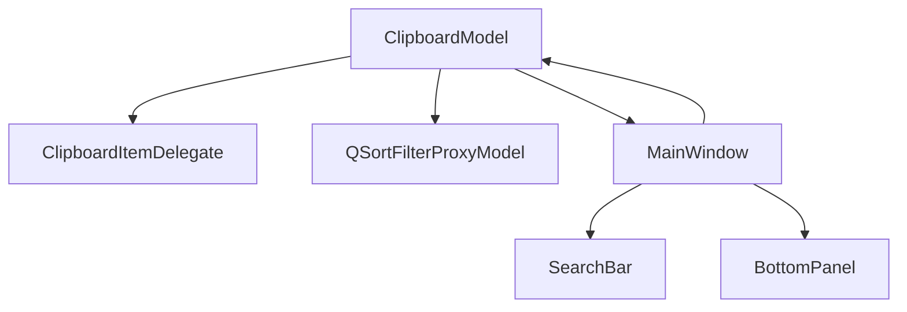

Design UI Plan for Clipboard Manager

- Goals: create a clean dark theme with blue accents and a layout resembling the reference screenshot, ensuring readability and responsive behavior.
- Architecture overview:
-  ClipboardModel: stores clipboard items and exposes data via Qt roles
-  m_proxyModel: QSortFilterProxyModel wrapping ClipboardModel for filtering/sorting
-  m_listView: QListView displaying items via ClipboardItemDelegate
  - ClipboardItemDelegate: custom rendering for list items (white text, dark background, blue highlight, optional icons)
  - ProxyModel (QSortFilterProxyModel): provides filtering and sorting capabilities
  - MainWindow: contains the QListView, Search Bar, and Bottom Action Panel
- Data flow:
  - Model provides item data to the view; view uses the delegate for rendering
  - Search Bar updates the ProxyModel filter; changes propagate to the view
- UI components:
  - Top: Search Bar (QLineEdit) with placeholder Начните печатать для поиска...
  - Center: QListView with ClipboardItemDelegate
-  Bottom: Action panel with buttons Очистить всё, Настройки, О приложении, Завершить
- Styling strategy:
  - resources/styles.qss will define color tokens and theme rules
  - Tokens: background, surface, text, mutedText, accent, highlight
|  Mermaid diagram:

- 1 Анализ текущего UI: In Progress
- 2 Спроектировать архитектуру дизайна: In Progress
- 3 Добавить стили: In Progress
- 4 Реализовать ClipboardItemDelegate: Completed
- 5 Фаза 4: добавить нижнюю панель действий (Очистить всё, Настройки, О приложении, Завершить): In Progress
- 5 Внедрить панель поиска: In Progress
- 6 Добавить фильтрацию и сортировку: In Progress
- 7 Обновить MainWindow: In Progress
- 8 Собрать проект: In Progress
- 9 Протестировать UX: In Progress
- 10 Подготовить скриншоты: In Progress
- 11 Mermaid диаграмма: In Progress
- 12 API контракты: In Progress
- 13 Wireframes: In Progress
- 14 Фаза 4: Добавить нижнюю панель действий (Очистить всё, Настройки, О приложении, Завершить): In Progress
- 4 Реализовать ClipboardItemDelegate: Completed
- [x] Уточнить имена компонентов MainWindow для реализации Фазы 3
- 5 Внедрить панель поиска: In Progress
- 6 Добавить фильтрацию и сортировку: In Progress
- 7 Обновить MainWindow: In Progress
- 8 Собрать проект: In Progress
- 9 Протестировать UX: In Progress
- 10 Подготовить скриншоты: In Progress
- 11 Mermaid диаграмма: In Progress
- 12 API контракты: In Progress
- 13 Wireframes: In Progress
